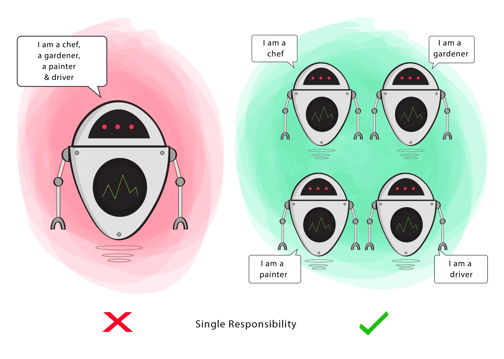
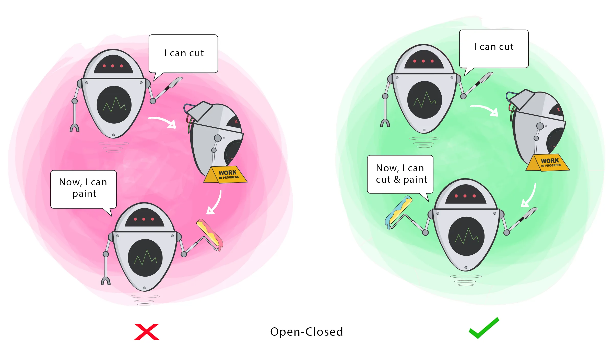

# SOLID


## Descrição

### O que é SOLID?

SOLID é um acrõnimo criado por Michael Feathers para observar 5 princípios da programação orientada a objetos que são considerados boas práticas para o desenvolvimento de software.

### Vantagens do SOLID

O uso dos princípios SOLID traz diversas vantagens para o desenvolvimento de software, aqui estão algumas das que eu encontrei:

- **Facilita a manutenção:** O SOLID propõe uma abordagem de código mais limpo e organizada, tornando o software mais fácil de entender e manter, isso reduz a probabilidade de erros e facilita a correção de bugs.
- **Aumenta a reutilização de código:** Implementações que aderem ao SOLID, de forma geral são mais coesas e possuem menos acoplamento, o que possibilita a reutilização de código em diversas partes do software.
- **Melhora a testabilidade:** Classes que seguem o SOLID tendem a ser mais fáceis de testar, pois possuem apenas 1 responsabilidade e são claramente definidas, isso facilita a criação de testes unitários.
- **Aumenta a compreensão do código:** Códigos que seguem os príncipios SOLID são mais legíveis e compreensíveis, facilitando a colaboração entre outros membros da equipe e a manutenção a longo prazo.
- **Melhora a arquitetura de forma geral:** O SOLID contribui para uma arquitetura de software mais robusta e flexível, tornando o software adaptável a mudanças nos requisitos e nas necessidades dos usuários.

Em resumo, o uso dos princípios do SOLID resulta em software de maior qualidade, mais flexível e fácil de manter. Isso é crucial em projetos de desenvolvimento de software de longo prazo, nos quais a escalabilidade e a manutenção são fatores críticos para o sucesso.

## Os princípios SOLID

1. **Princípio da Responsabilidade Única (SRP - Single Responsibility Principle):** Este princípio afirma que uma classe deve ter apenas uma razão para mudar. Em outras palavras, uma classe deve ter apenas uma responsabilidade ou tarefa específica no sistema. Isso ajuda a evitar classes inchadas que fazem muitas coisas e torna o código mais fácil de entender e manter.

2. **Princípio do Aberto/Fechado (OCP - Open/Closed Principle):** O OCP estabelece que as entidades de software (classes, módulos, etc.) devem estar abertas para extensão, mas fechadas para modificação. Isso significa que você deve poder adicionar novos recursos ou comportamentos sem alterar o código existente.

3. **Princípio da Substituição de Liskov (LSP - Liskov Substitution Principle):** Este princípio diz que objetos de uma classe derivada devem ser capazes de substituir objetos da classe base sem afetar a integridade do programa. Em outras palavras, as subclasses devem ser compatíveis com as superclasses.

4. **Princípio da Segregação de Interfaces (ISP - Interface Segregation Principle):** O ISP sugere que as interfaces de uma classe devem ser segregadas em interfaces menores e mais específicas, em vez de ter uma única interface grande. Isso evita que as classes implementem métodos que não precisam, tornando o código mais coeso.

5. **Princípio da Inversão de Dependência (DIP - Dependency Inversion Principle):** O DIP enfatiza que as classes de alto nível não devem depender de classes de baixo nível, mas sim de abstrações. Além disso, ele incentiva a inversão do controle, permitindo que módulos de baixo nível dependam de abstrações, tornando o código mais flexível e facilmente adaptável a mudanças.

## SRP - Single Responsibility Principle

>**Princípio da Responsabilidade Única:** uma classe deve ter uma, e somente uma responsabilidade.



Uma classe deve ter apenas uma responsabilidade dentro do código, ou seja, ela deve ter apenas um motivo para existir.
Se uma classe tem mais de uma responsabilidade, ela tem mais de um motivo para ser alterada.

### Como podemos identificar uma classe que esta fora do SRP?

Identificar uma classe que não está seguindo o princípio da Responsabilidade Única (SRP) pode ser feito observando seu comportamento e responsabilidades. Aqui estão algumas dicas para identificar classes que violam o SRP:

**Número de Responsabilidades:** Se uma classe está desempenhando múltiplas funções ou responsabilidades, é provável que esteja violando o SRP. Por exemplo, se uma classe é responsável por armazenar dados, realizar cálculos e interagir com uma base de dados, isso é um sinal de que a classe pode ter múltiplas responsabilidades.

**Verbos no Nome da Classe ou Métodos:** Um indicativo de que uma classe pode estar violando o SRP é se o nome da classe ou os nomes dos métodos contêm verbos que descrevem várias ações. Classes devem geralmente ter nomes que representam substantivos ou entidades e métodos com nomes que descrevem uma única ação.

**Complexidade dos Métodos:** Se os métodos de uma classe são muito longos e realizam uma variedade de tarefas diferentes, isso é um sinal de que a classe pode ter várias responsabilidades. Métodos muito longos e complexos geralmente indicam falta de coesão.

**Dependências Excessivas:** Se uma classe depende de muitas outras classes ou módulos, especialmente para finalidades diferentes, isso pode ser um indício de falta de responsabilidade única. Classes com muitas dependências tendem a ser mais difíceis de manter e entender.

**Frequente Necessidade de Alterações na Classe:** Se você perceber que sempre precisa fazer alterações na mesma classe para acomodar diferentes requisitos ou mudanças de negócio, isso pode ser um sinal de que a classe está sobrecarregada com responsabilidades.

**Teste de Unidade Complexos:** Se escrever testes de unidade para a classe é complexo e requer muitos cenários diferentes, isso pode indicar uma violação do SRP. Classes com múltiplas responsabilidades tendem a ser difíceis de testar de forma isolada.

**Feedback dos Colegas de Desenvolvimento:** A revisão de código por colegas de desenvolvimento também é uma ótima maneira de identificar problemas de design, incluindo violações do SRP. Peça feedback e opiniões sobre se uma classe parece estar fazendo muito.

### Exemplo

```kotlin

class User(
    val name: String,
    val email: String,
    val password: String
) {
    fun save() {
        // Salva o usuário no banco de dados
    }

    fun sendEmail(user: User) {
        // Envia um email para o usuário
    }
}

```

Como podemos ver no exemplo, a classe User, é responsável por:

- Gerenciar os parâmetros de um usuário
- Salvar o usuário no bando de dados
- Enviar um email para um usuário

Isso gera um alto acoplamento, e não conseguimos reutilizar o código em outras partes do software.

Refatorando e aplicando o SRP na classe user, teremos o seguinte código:

```kotlin

class User(
    val name: String,
    val email: String,
    val password: String
)

class DataBase() {
    fun saveUser(user: User) {
        // Salva um usuário no banco de dados
    }
}

class EmailSender() {
    fun sendEmail(sender: User, recipient: User) {
        // Envia um email para o usuário
    }
}

```

Separamos as responsabilidades em +2 classes.

- A classe user fica responsável somente por gerenciar os parâmetros de um usuário.
- A classe database é responsável por gerenciar o bando de dados, então ela pode salvar, deletar e exibir um usuário.
- A classe emailsender é responsável pelo envio de emails de um usuário a outro.

Agora, além de cada classe ter somente uma responsabilidade, também podemos reutilizar o código em outras partes do software.

## OCP - Open Closed Principle

>**Princípio do Aberto/Fechado:** Uma classe deve ser capaz de ser extendida sem ser modificada



Promove a Extensibilidade: O princípio do Aberto/Fechado (OCP) incentiva a adição de novos recursos sem modificar o código existente. Isso torna o software mais extensível, permitindo a evolução do sistema de forma mais suave.

### Como podemos identificar uma classe que esta fora do OCP?

### Exemplo

## Referências

### Cursos

- [SOLID - Os 5 Princípios Para as Boas Práticas da POO](https://www.udemy.com/share/10358U/)

### Vídeos

- [Programadores com código sujo : SOLID](https://www.youtube.com/watch?v=J2ugvRObGT4&ab_channel=LucasMontano)
- [SOLID fica FÁCIL com Essas Ilustrações](https://www.youtube.com/watch?v=6SfrO3D4dHM&ab_channel=FilipeDeschamps)
- [SOLID - O básico para você programar melhor](https://www.youtube.com/watch?v=mkx0CdWiPRA&ab_channel=C%C3%B3digoFonteTV)

### Posts

- [S.O.L.I.D no Android](https://medium.com/android-dev-br/s-o-l-i-d-no-android-d55e23f1c72d)
- [The SOLID Principles for Android Developers](https://medium.com/kayvan-kaseb/the-solid-principles-for-android-developers-75fd4ca3ef84)
- [O que é SOLID: O guia completo para você entender os 5 princípios da POO](https://medium.com/desenvolvendo-com-paixao/o-que-%C3%A9-solid-o-guia-completo-para-voc%C3%AA-entender-os-5-princ%C3%ADpios-da-poo-2b937b3fc530)
- [SOLID — Princípios da Programação Orientada a Objetos](https://medium.com/thiago-aragao/solid-princ%C3%ADpios-da-programa%C3%A7%C3%A3o-orientada-a-objetos-ba7e31d8fb25)
- [The S.O.L.I.D Principles in Pictures](https://medium.com/backticks-tildes/the-s-o-l-i-d-principles-in-pictures-b34ce2f1e898)
- [Os Princípios SOLID em Imagens](https://warcontent.com/principios-solid-imagens/)

### Repositórios

- [SOLID-kotlin](https://github.com/marceloalves95/SOLID-Kotlin)

### Podcasts

- [SOLID: Código bom e bonito](https://open.spotify.com/episode/6fRVaqJxqrqilW1sfQh1pk?si=eRUgCrZgQ8Oq2SNECDocjw)
