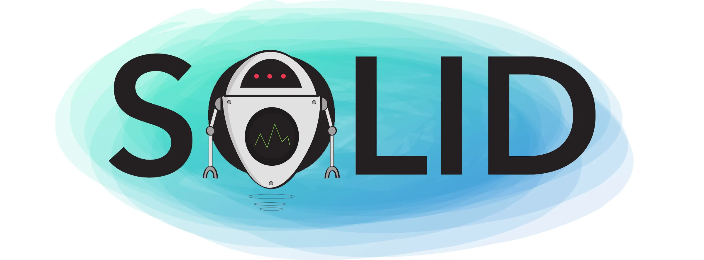

# SOLID



## Descrição

### O que é SOLID?

SOLID é um acrõnimo criado por Michael Feathers para observar 5 princípios da programação orientada a objetos que são considerados boas práticas para o desenvolvimento de software.

### Vantagens do SOLID

- Códigos mais fáceis de se manter, de serem adaptados e de se ajustarem a mudanças.
- Códigos testaveis e de fácil entendimento
- Códigos que fornecem o máximo de reaproveitamento
- Aplicações com ciclo de vida maiores
- Códigos mais limpos e organizados

## Principios

### SRP - Single Responsibility Principle (Princípio da Responsabilidade Única)


>Uma classe deve ter um, e somente uma responsabilidade.

Uma classe deve ter apenas uma responsabilidade dentro do código, ou seja, ela deve ter apenas um motivo para ser alterada.
Se uma classe tem mais de uma responsabilidade, ela tem mais de um motivo para ser alterada, o que fere o princípio SRP.

#### Como podemos identificar uma classe que esta fora do SRP?

- A classe possui muitos atributos ou métodos.
- Podemos identificar quando a classe possui muitos "e" ou "ou" em sua descrição.
- A classe é chamada por clientes que não usam todos os seus atributos e métodos e possui muitas dependências.

#### Códigos exeplos

##### Código fora do SRP

```kotlin

class User(
    val name: String,
    val email: String,
    val password: String
) {
    fun save() {
        // Salva o usuário no banco de dados
    }

    fun sendEmail() {
        // Envia um email para o usuário
    }
}

```

##### Código dentro do SRP

```kotlin

class User(
    val name: String,
    val email: String,
    val password: String
) {
    fun save() {
        // Salva o usuário no banco de dados
    }
}

class EmailSender(
    val user: User
) {
    fun sendEmail() {
        // Envia um email para o usuário
    }
}

```

### OCP - Open Closed Principle (Princípio do Aberto/Fechado)


### LSP - Liskov Substitution Principle (Princípio da Substituição de Liskov)


### ISP - Interface Segregation Principle (Princípio da Segregação de Interfaces)


### DIP - Dependency Inversion Principle (Princípio da Inversão de Dependências)


## Referências

### Cursos

- [SOLID - Os 5 Princípios Para as Boas Práticas da POO](https://www.udemy.com/share/10358U/)

### Vídeos

- [Programadores com código sujo : SOLID](https://www.youtube.com/watch?v=J2ugvRObGT4&ab_channel=LucasMontano)
- [SOLID fica FÁCIL com Essas Ilustrações](https://www.youtube.com/watch?v=6SfrO3D4dHM&ab_channel=FilipeDeschamps)
- [SOLID - O básico para você programar melhor](https://www.youtube.com/watch?v=mkx0CdWiPRA&ab_channel=C%C3%B3digoFonteTV)

### Posts

- [S.O.L.I.D no Android](https://medium.com/android-dev-br/s-o-l-i-d-no-android-d55e23f1c72d)
- [The SOLID Principles for Android Developers](https://medium.com/kayvan-kaseb/the-solid-principles-for-android-developers-75fd4ca3ef84)
- [O que é SOLID: O guia completo para você entender os 5 princípios da POO](https://medium.com/desenvolvendo-com-paixao/o-que-%C3%A9-solid-o-guia-completo-para-voc%C3%AA-entender-os-5-princ%C3%ADpios-da-poo-2b937b3fc530)
- [SOLID — Princípios da Programação Orientada a Objetos](https://medium.com/thiago-aragao/solid-princ%C3%ADpios-da-programa%C3%A7%C3%A3o-orientada-a-objetos-ba7e31d8fb25)
- [The S.O.L.I.D Principles in Pictures](https://medium.com/backticks-tildes/the-s-o-l-i-d-principles-in-pictures-b34ce2f1e898)
- [Os Princípios SOLID em Imagens](https://warcontent.com/principios-solid-imagens/)

### Repositórios

- [SOLID-kotlin](https://github.com/marceloalves95/SOLID-Kotlin)

### Podcasts

- [SOLID: Código bom e bonito](https://open.spotify.com/episode/6fRVaqJxqrqilW1sfQh1pk?si=eRUgCrZgQ8Oq2SNECDocjw)
